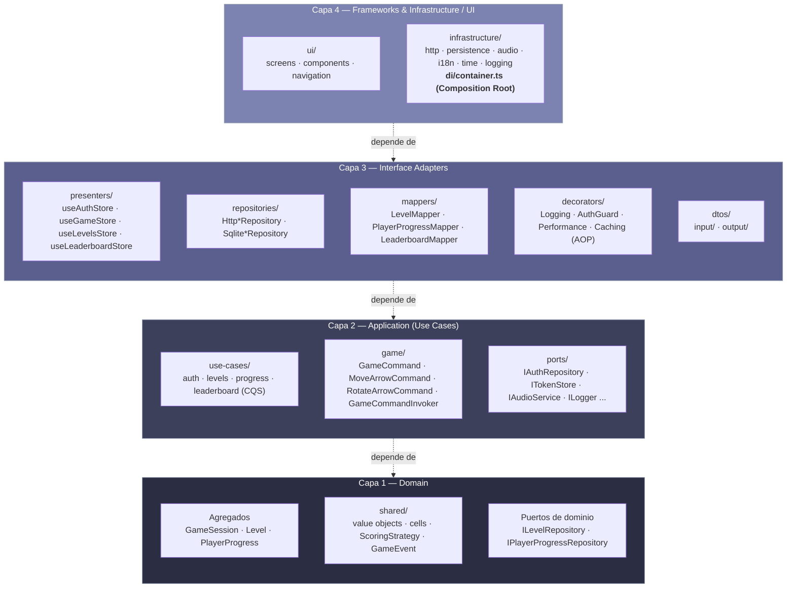
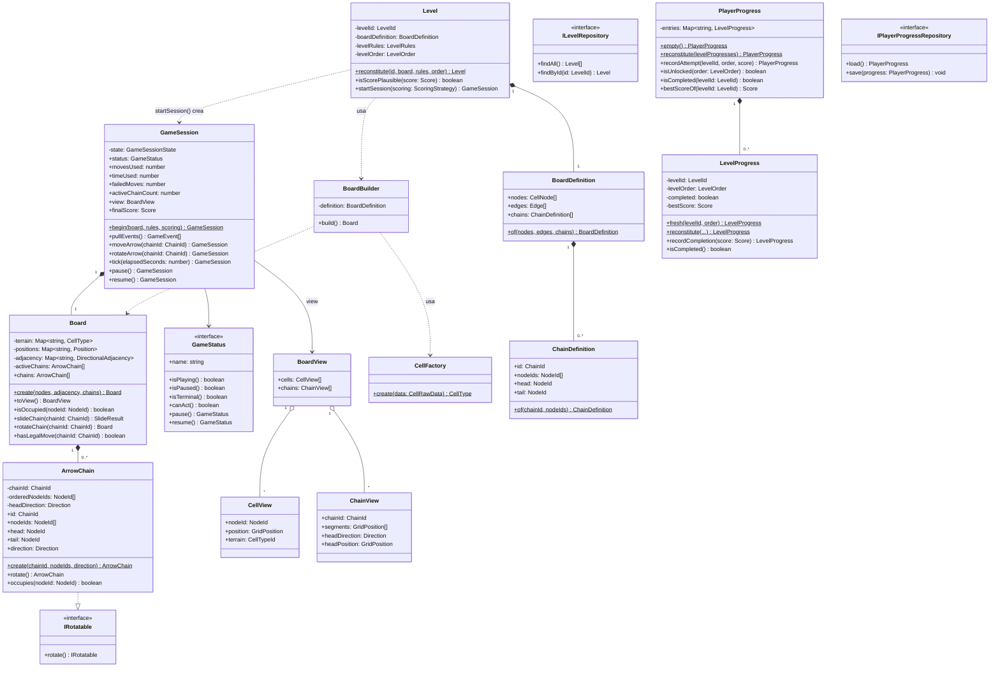

# Arrow Maze — Escape Puzzle (Cliente React Native)

Cliente móvil del juego de puzzle **Arrow Maze**, construido con **React Native + Expo** y
**TypeScript estricto**. Implementa toda la mecánica del juego (movimiento, rotación,
colisión, victoria/derrota, puntuación) en el cliente; el backend (NestJS + PostgreSQL,
repositorio hermano) solo crea, valida estructuralmente y sirve niveles.

El proyecto sigue **Clean Architecture** (4 capas) + **SOLID** + patrones **GoF** + **AOP vía
Decorator** + **DDD táctico con agregados**. La guía completa de arquitectura vive en
[`CLAUDE.md`](./CLAUDE.md) — este README resume lo esencial y documenta el **diagrama de
clases real** del código, no el aspiracional.

---

## Tabla de contenidos

- [Stack tecnológico](#stack-tecnológico)
- [Arquitectura](#arquitectura)
  - [Diagrama de capas (Clean Architecture)](#diagrama-de-capas-clean-architecture)
- [Estructura de carpetas](#estructura-de-carpetas)
- [Diagrama de clases](#diagrama-de-clases)
  - [1. Dominio — agregados](#1-dominio--agregados-gamesession-level-playerprogress)
  - [2. Dominio — kernel compartido](#2-dominio--kernel-compartido-cells-value-objects-scoring-events)
  - [3. Aplicación — casos de uso y CQS](#3-aplicación--casos-de-uso-y-cqs)
  - [4. Adaptadores e infraestructura](#4-adaptadores-e-infraestructura)
- [AOP — decoradores implementados](#aop--decoradores-implementados)
- [Reglas del juego](#reglas-del-juego-invariantes-de-gamesession)
- [Arquitectura de testing](#arquitectura-de-testing)
- [Cómo correr el proyecto](#cómo-correr-el-proyecto)
- [Conventional Commits](#conventional-commits)

---

## Stack tecnológico

| Área | Decisión |
| --- | --- |
| Framework | React Native con **Expo** (managed workflow) |
| Lenguaje | TypeScript (`strict: true`, sin `any`) |
| Estado / Presenters | **Zustand**, confinado a `interface-adapters/presenters/` |
| Navegación | React Navigation (native-stack) |
| Persistencia local | `expo-sqlite` (progreso + cache de leaderboard) + `expo-secure-store` (token JWT) |
| Audio | `expo-audio` |
| i18n | `i18next` + `react-i18next` + `expo-localization` (ES / EN) |
| HTTP | `fetch` envuelto en un `HttpClient` propio |
| Testing | Jest + `jest-mock-extended` |
| CI/CD | GitHub Actions |

---

## Arquitectura

```
Frameworks / UI  →  Interface Adapters  →  Application (Use Cases)  →  Domain
```

- **`domain/`** no importa nada del proyecto — ni Expo, ni Zustand, ni React, ni `fetch`.
- **`application/`** solo importa `domain/` (casos de uso CQS + patrón Command para las
  acciones de juego, que no tocan puertos).
- **`interface-adapters/`** implementa los puertos técnicos y traduce DTO ↔ dominio.
- **`infrastructure/`** y **`ui/`** cablean todo; **`infrastructure/di/container.ts`** es el
  único archivo del proyecto que instancia clases concretas (Composition Root).

**AOP** se resuelve con el patrón **Decorator** sobre los puertos CQS
(`ICommandService`/`IQueryService`), nunca con una librería de AOP: el Composition Root arma
la cadena `AuthGuard → Logging → Performance/Caching → caso de uso real`.

### Diagrama de capas (Clean Architecture)

Las flechas representan **dependencias de código** (import), no flujo de datos — siempre
apuntan hacia adentro. `domain/` no depende de nada; todo lo demás depende, directa o
transitivamente, de `domain/`.



> `domain/` **no importa nada** de las capas externas — ni siquiera de `application/`. Los
> puertos de repositorio (`ILevelRepository`, `IPlayerProgressRepository`) viven **junto al
> agregado en el dominio** (repository-as-contract, DDD), no en `application/ports/`; solo
> los puertos técnicos (`IAuthRepository`, `ITokenStore`, `IAudioService`, etc.) están ahí.
> `infrastructure/di/container.ts` es el único punto del proyecto donde una capa externa
> conoce clases concretas de las capas internas — el resto siempre depende de interfaces.

---

## Estructura de carpetas

```
src/
├─ domain/
│  ├─ game-session/     # AGREGADO — GameSession (raíz), Board, ArrowChain, GameStatus
│  ├─ level/             # AGREGADO — Level (raíz), BoardBuilder, CellFactory, ILevelRepository
│  ├─ player-progress/   # AGREGADO — PlayerProgress (raíz), LevelProgress
│  └─ shared/             # VOs y piezas usadas por 2+ agregados: cells, value-objects,
│                          #   services (ScoringStrategy), events (GameEvent), errors
├─ application/
│  ├─ cqs/                # ICommandService, IQueryService
│  ├─ use-cases/          # auth/ levels/ progress/ leaderboard/
│  ├─ game/                # Patrón Command: GameCommand, MoveArrowCommand,
│  │                        #   RotateArrowCommand, GameCommandInvoker
│  └─ ports/                # puertos técnicos (IAuthRepository, ITokenStore, IAudioService...)
├─ interface-adapters/
│  ├─ presenters/          # useAuthStore, useGameStore, useLevelsStore, useLeaderboardStore
│  ├─ repositories/        # Http*, Sqlite*
│  ├─ mappers/               # LevelMapper, PlayerProgressMapper, LeaderboardMapper
│  ├─ decorators/            # AOP: Logging / AuthGuard / Performance / Caching
│  ├─ ports/                  # IHttpClient, IPlayerProgressStore, ILeaderboardStore
│  └─ dtos/                    # input/ (lo que el cliente manda) · output/ (lo que devuelve el backend)
├─ infrastructure/
│  ├─ http/  persistence/  audio/  i18n/  time/  logging/
│  └─ di/container.ts       # Composition Root
└─ ui/
   ├─ screens/  components/  navigation/
```

---

## Diagrama de clases

Los diagramas siguientes reflejan el **código real** (`src/`), verificado archivo por
archivo. Están separados por capa para que cada uno se pueda leer sin cruzar la regla de
dependencia.

### 1. Dominio — agregados (`GameSession`, `Level`, `PlayerProgress`)



> **Nota:** `Level.startSession()`, `ScoringStrategy`, `GameEvent` y el agregado completo
> `PlayerProgress`/`LevelProgress` **ya están implementados** — `CLAUDE.md` los marca como
> "pendiente" en un comentario de árbol de carpetas que quedó desactualizado.

### 2. Dominio — kernel compartido (cells, value objects, scoring, events)

```mermaid
classDiagram
    class CellType {
        <<interface>>
        +id: CellTypeId
        +isPassable() boolean
    }
    class ArrowCell {
        <<interface>>
        +direction: Direction
    }
    class EmptyCell {
        +id: "empty"
        +isPassable() boolean
    }
    class ExitCell {
        +id: "exit"
        +isPassable() boolean
    }
    class WallCell {
        +id: "wall"
        +isPassable() boolean
    }
    class GridArrowCell {
        +id: "grid_arrow"
        +direction: Direction
        +isPassable() boolean
    }
    ArrowCell --|> CellType
    EmptyCell ..|> CellType
    ExitCell ..|> CellType
    WallCell ..|> CellType
    GridArrowCell ..|> ArrowCell

    class CellNode {
        +id: NodeId
        +at: Position
        +terrain: CellType
        +isExit() boolean
        +isArrowSeed() boolean
    }
    class Edge {
        +from: NodeId
        +to: NodeId
        +connects(nodeId: NodeId) boolean
    }
    CellNode --> CellType
    CellNode --> Position

    class Position {
        <<interface>>
        +equals(other: Position) boolean
    }
    class GridPosition {
        +of(row, column)$ GridPosition
        +rowIndex: number
        +columnIndex: number
        +equals(other) boolean
    }
    class Direction {
        <<interface>>
        +id: string
        +rotateClockwise() Direction
        +equals(other: Direction) boolean
    }
    class GridDirection {
        +Up$ GridDirection
        +Right$ GridDirection
        +Down$ GridDirection
        +Left$ GridDirection
        +of(id)$ GridDirection
        +rotateClockwise() Direction
    }
    GridPosition ..|> Position
    GridDirection ..|> Direction

    class NodeId { +of(value)$ NodeId +equals(other) boolean +toString() string }
    class ChainId { +of(value)$ ChainId +equals(other) boolean +toString() string }
    class LevelId { +of(value)$ LevelId +equals(other) boolean +toString() string }
    class LevelOrder {
        +of(value)$ LevelOrder
        +sequence: number
        +isFirst() boolean
        +previous() LevelOrder
    }
    class LevelRules {
        +of(timeLimitSeconds, maxMoves, maxPossibleScore)$ LevelRules
        +timeLimit: number
        +maxMoves: number
        +maxPossibleScore: number
    }
    class Score {
        +of(value)$ Score
        +zero()$ Score
        +points: number
        +isGreaterThan(other: Score) boolean
    }

    class ScoringStrategy {
        <<interface>>
        +score(input: ScoringInput) Score
    }
    class FailedMovesScoringStrategy {
        +score(input) Score
    }
    class TimeAndFailedMovesScoringStrategy {
        +score(input) Score
    }
    FailedMovesScoringStrategy ..|> ScoringStrategy
    TimeAndFailedMovesScoringStrategy ..|> ScoringStrategy

    class GameEvent {
        <<interface>>
        +name: string
    }
    class ArrowChainExited {
        +chainId: ChainId
    }
    class LevelCompleted {
        +score: Score
    }
    ArrowChainExited ..|> GameEvent
    LevelCompleted ..|> GameEvent

    class DomainError {
        +message: string
    }
```



### 3. Aplicación — casos de uso y CQS

```mermaid
classDiagram
    class ICommandService~TCommand~ {
        <<interface>>
        +execute(command: TCommand) void
    }
    class IQueryService~TQuery, TResult~ {
        <<interface>>
        +execute(query: TQuery) TResult
    }

    class GameCommand {
        <<interface>>
        +execute(session: GameSession) GameSession
    }
    class MoveArrowCommand {
        +chainId: ChainId
        +execute(session) GameSession
    }
    class RotateArrowCommand {
        +chainId: ChainId
        +execute(session) GameSession
    }
    class GameCommandInvoker {
        -current: GameSession
        +session: GameSession
        +execute(command: GameCommand) GameSession
        +tick(elapsedSeconds: number) GameSession
    }
    MoveArrowCommand ..|> GameCommand
    RotateArrowCommand ..|> GameCommand
    GameCommandInvoker --> GameCommand : ejecuta
    GameCommandInvoker --> GameSession

    class RegisterUserUseCase { +execute(RegisterUserCommand) void }
    class LoginUseCase { +execute(LoginQuery) LoginResult }
    class GetLevelsUseCase { +execute(GetLevelsQuery) Level[] }
    class StartGameUseCase { +execute(StartGameQuery) GameSession }
    class CompleteLevelUseCase { +execute(CompleteLevelCommand) void }
    class SyncProgressUseCase { +execute(SyncProgressCommand) void }
    class LoadPlayerProgressUseCase { +execute(LoadPlayerProgressQuery) PlayerProgress }
    class ClearLocalProgressUseCase { +execute(ClearLocalProgressCommand) void }
    class RestorePlayerProgressUseCase { +execute(RestorePlayerProgressCommand) void }
    class GetLeaderboardUseCase { +execute(GetLeaderboardQuery) LeaderboardEntryResult[] }
    class SyncLeaderboardsUseCase { +execute(SyncLeaderboardsCommand) void }

    RegisterUserUseCase ..|> ICommandService
    LoginUseCase ..|> IQueryService
    GetLevelsUseCase ..|> IQueryService
    StartGameUseCase ..|> IQueryService
    CompleteLevelUseCase ..|> ICommandService
    SyncProgressUseCase ..|> ICommandService
    LoadPlayerProgressUseCase ..|> IQueryService
    ClearLocalProgressUseCase ..|> ICommandService
    RestorePlayerProgressUseCase ..|> ICommandService
    GetLeaderboardUseCase ..|> IQueryService
    SyncLeaderboardsUseCase ..|> ICommandService

    class IAuthRepository { <<interface>> }
    class ILeaderboardRepository { <<interface>> }
    class ILeaderboardCache { <<interface>> }
    class IProgressSyncPort { <<interface>> +sync() void +fetchAll() ProgressEntry[] }
    class ITokenStore { <<interface>> }

    RegisterUserUseCase --> IAuthRepository
    LoginUseCase --> IAuthRepository
    LoginUseCase --> ITokenStore
    GetLevelsUseCase --> ILevelRepository
    StartGameUseCase --> ILevelRepository
    StartGameUseCase --> ScoringStrategy
    CompleteLevelUseCase --> IPlayerProgressRepository
    CompleteLevelUseCase --> IProgressSyncPort
    SyncProgressUseCase --> IProgressSyncPort
    LoadPlayerProgressUseCase --> IPlayerProgressRepository
    ClearLocalProgressUseCase --> IPlayerProgressRepository
    RestorePlayerProgressUseCase --> ILevelRepository
    RestorePlayerProgressUseCase --> IProgressSyncPort
    RestorePlayerProgressUseCase --> IPlayerProgressRepository
    GetLeaderboardUseCase --> ILeaderboardRepository
    SyncLeaderboardsUseCase --> ILeaderboardRepository
    SyncLeaderboardsUseCase --> ILeaderboardCache
```



> Las acciones de juego (`moveArrow`/`rotateArrow`) **no son casos de uso** — no tocan
> puertos. Se orquestan con `GameCommandInvoker` (patrón Command puro) desde
> `useGameStore`, que llama directo a `GameSession`.

### 4. Adaptadores e infraestructura

```mermaid
classDiagram
    class AuthGuardCommandDecorator~TCommand~ {
        -decoratee: ICommandService~TCommand~
        -tokenStore: ITokenStore
        +execute(command) void
    }
    class AuthGuardQueryDecorator~TQuery, TResult~ {
        +execute(query) TResult
    }
    class LoggingCommandDecorator~TCommand~ {
        -logger: ILogger
        -timeProvider: ITimeProvider
        +execute(command) void
    }
    class LoggingQueryDecorator~TQuery, TResult~ {
        +execute(query) TResult
    }
    class PerformanceQueryDecorator~TQuery, TResult~ {
        -slowThresholdMs: number
        +execute(query) TResult
    }
    class CachingQueryDecorator~TQuery, TResult~ {
        -cache: Map
        -ttlMs: number
        +execute(query) TResult
    }
    class ICommandService~T~ { <<interface>> }
    class IQueryService~T, R~ { <<interface>> }

    AuthGuardCommandDecorator ..|> ICommandService
    LoggingCommandDecorator ..|> ICommandService
    AuthGuardQueryDecorator ..|> IQueryService
    LoggingQueryDecorator ..|> IQueryService
    PerformanceQueryDecorator ..|> IQueryService
    CachingQueryDecorator ..|> IQueryService

    class HttpAuthRepository { +register() void +login() LoginResult }
    class HttpLeaderboardRepository { +findTop() LeaderboardEntryResult[] }
    class HttpLevelRepository { -cachedLevels: Level[] +findAll() Level[] +findById() Level }
    class HttpProgressSyncAdapter { +sync() void +fetchAll() ProgressEntry[] }
    class SqliteLeaderboardRepository { +findTop() LeaderboardEntryResult[] +replaceTop() void }
    class SqlitePlayerProgressRepository { +load() PlayerProgress +save() void }

    HttpAuthRepository ..|> IAuthRepository
    HttpLeaderboardRepository ..|> ILeaderboardRepository
    HttpLevelRepository ..|> ILevelRepository
    HttpProgressSyncAdapter ..|> IProgressSyncPort
    SqliteLeaderboardRepository ..|> ILeaderboardRepository
    SqliteLeaderboardRepository ..|> ILeaderboardCache
    SqlitePlayerProgressRepository ..|> IPlayerProgressRepository

    class ILeaderboardStore { <<interface>> +loadTop() LeaderboardEntryRow[] +replaceForLevel() void }
    class IPlayerProgressStore { <<interface>> +loadAll() PlayerProgressRow[] +saveAll() void }
    class IHttpClient { <<interface>> +get() T +post() T }

    class SqliteLeaderboardStore { +loadTop() LeaderboardEntryRow[] +replaceForLevel() void }
    class SqlitePlayerProgressStore { +loadAll() PlayerProgressRow[] +saveAll() void }
    class HttpClient { +get() T +post() T }
    class SecureTokenStore { +saveSession() void +getAccessToken() string +clearSession() void }
    class ExpoAudioService { +getInstance(sources)$ ExpoAudioService +playEffect() void +setMuted() void }
    class SystemTimeProvider { +now() number }
    class ConsoleLogger { +info() void +warn() void +error() void }
    class I18nLocalizationService { +translate() string +getLocale() string +setLocale() void }

    SqliteLeaderboardRepository --> ILeaderboardStore
    SqlitePlayerProgressRepository --> IPlayerProgressStore
    SqliteLeaderboardStore ..|> ILeaderboardStore
    SqlitePlayerProgressStore ..|> IPlayerProgressStore
    HttpClient ..|> IHttpClient
    SecureTokenStore ..|> ITokenStore
    ExpoAudioService ..|> IAudioService
    SystemTimeProvider ..|> ITimeProvider
    ConsoleLogger ..|> ILogger
    I18nLocalizationService ..|> ILocalizationService

    class LevelMapper { +toDomain(dto: LevelDTO)$ Level }
    class PlayerProgressMapper { +toDomain(rows)$ PlayerProgress +toRows(progress)$ PlayerProgressRow[] }
    class LeaderboardMapper { +toDomain(dtos)$ LeaderboardEntryResult[] }
```



Las **presenters** (`useAuthStore`, `useGameStore`, `useLevelsStore`, `useLeaderboardStore`)
no son clases sino *factory functions* que devuelven un store Zustand — por eso no aparecen
en el diagrama UML. Su forma real:

| Store | Estado expuesto | Casos de uso inyectados |
| --- | --- | --- |
| `createAuthStore` | `session, isAuthenticating, error` + `register, login, logout, restoreSession` | `RegisterUserUseCase`, `LoginUseCase`, `ClearLocalProgressUseCase`, `RestorePlayerProgressUseCase`, `ITokenStore` |
| `createGameStore` | `session: GameSession \| null, isLoading, error` + `startGame, moveArrow, rotateArrow, tick` | `StartGameUseCase`, `CompleteLevelUseCase`, `IAudioService` (sostiene un `GameCommandInvoker` interno) |
| `createLevelsStore` | `levels, progress, isLoading, error` + `loadLevels, isUnlocked` | `GetLevelsUseCase`, `LoadPlayerProgressUseCase`, `SyncLeaderboardsUseCase` |
| `createLeaderboardStore` | `entries, isLoading, error` + `loadLeaderboard` | `GetLeaderboardUseCase` |

`infrastructure/di/container.ts` es el **Composition Root**: instancia todos los adaptadores
concretos de arriba, arma la cadena de decoradores (`AuthGuard → Logging →
Performance/Caching → caso de uso real`) y crea los 4 stores — es el único archivo del
proyecto que conoce clases concretas.

---

## AOP — decoradores implementados

El proyecto **no usa ninguna librería de AOP** (nada de `reflect-metadata`, decoradores
`@Injectable`/`@Around`, etc.). Los *cross-cutting concerns* (logging, autenticación,
performance, cache) se resuelven con el patrón **GoF Decorator** aplicado sobre los dos
puertos CQS de método único (`ICommandService<TCommand>` / `IQueryService<TQuery, TResult>`):
cada aspecto es una clase que implementa el **mismo puerto** que el caso de uso que envuelve
y delega en él por composición (`decoratee`). El caso de uso real nunca sabe que está
decorado — nunca llama al logger, nunca revisa la sesión.

Viven todos en `src/interface-adapters/decorators/`, un archivo por decorador, **cada uno
con su par Command/Query** para no romper CQS mezclando ambos puertos en una sola clase:

| Decorador | Puerto | Qué hace | Dependencias |
| --- | --- | --- | --- |
| `AuthGuardCommandDecorator` / `AuthGuardQueryDecorator` | `ICommandService` / `IQueryService` | Antes de delegar, llama a `tokenStore.hasActiveSession()`; si no hay sesión activa, lanza `Error('Not authenticated')` y **ni siquiera invoca** al `decoratee`. | `ITokenStore` |
| `LoggingCommandDecorator` / `LoggingQueryDecorator` | `ICommandService` / `IQueryService` | Loguea `"<caso> started"` antes, y `"<caso> completed"` (con `durationMs`) o `"<caso> failed"` (con el error) después — en un `try/catch` que siempre re-lanza, para no tragarse errores. | `ILogger`, `ITimeProvider`, `useCaseName` |
| `PerformanceQueryDecorator` | `IQueryService` | Mide la duración con `ITimeProvider` y solo emite un `logger.warn(...)` si supera `slowThresholdMs` (1000ms por defecto). A diferencia de `LoggingQueryDecorator`, que narra **toda** llamada, este solo se queja de las **lentas** — un concern distinto, una clase distinta. | `ILogger`, `ITimeProvider`, `slowThresholdMs` |
| `CachingQueryDecorator` | `IQueryService` | Memoiza el resultado en un `Map` interno con TTL (`expiresAt`), usando una función `keyOf(query)` inyectada para construir la clave de cache — así es genérico sobre cualquier query, no conoce `GetLeaderboardUseCase` ni ningún caso de uso concreto. | `ITimeProvider`, `ttlMs`, `keyOf` |

No existe una versión *Caching* ni *Performance* del lado Command a propósito: mutar no es
cacheable, y por ahora ningún command es lo bastante costoso como para justificar medirlo.

### Cómo se arman las cadenas (composición, no herencia)

El Composition Root (`infrastructure/di/container.ts`) decide, caso de uso por caso de uso,
qué decoradores aplicar y en qué orden — el orden importa: **AuthGuard va afuera de todo**
para no gastar tiempo en logging/caching de una llamada que ni siquiera está autenticada.

```
AuthGuard → Logging → Performance / Caching → caso de uso real
```

Ejemplos reales tomados de `container.ts`:

```ts
// Query protegida simple (§14: Auth ✅)
const decoratedGetLevelsUseCase = new AuthGuardQueryDecorator(
  new LoggingQueryDecorator(getLevelsUseCase, logger, timeProvider, 'GetLevelsUseCase'),
  tokenStore,
);

// Query protegida y costosa: Performance queda pegado al caso de uso real,
// Logging por fuera de Performance, AuthGuard por fuera de todo.
const decoratedStartGameUseCase = new AuthGuardQueryDecorator(
  new LoggingQueryDecorator(
    new PerformanceQueryDecorator(startGameUseCase, logger, timeProvider, 'StartGameUseCase'),
    logger, timeProvider, 'StartGameUseCase',
  ),
  tokenStore,
);

// Query protegida y cacheable: Caching queda pegado al caso de uso real
// (para que Logging reporte el tiempo real de la llamada, hit o miss).
const decoratedGetLeaderboardUseCase = new AuthGuardQueryDecorator(
  new LoggingQueryDecorator(
    new CachingQueryDecorator(
      getLeaderboardUseCase, timeProvider, 60_000,
      (query) => `${query.levelId.toString()}:${query.limit}`,
    ),
    logger, timeProvider, 'GetLeaderboardUseCase',
  ),
  tokenStore,
);

// Command público (§14: Auth ❌) — login/registro no pueden exigir sesión
// para conseguir una sesión, así que no llevan AuthGuard.
const decoratedLoginUseCase = new LoggingQueryDecorator(loginUseCase, logger, timeProvider, 'LoginUseCase');
```

`ClearLocalProgressUseCase` es la única excepción documentada a la regla "todo lo protegido
lleva AuthGuard": corre desde `logout()`, potencialmente **después** de que la sesión ya se
borró, así que solo lleva `Logging` — exigir sesión activa para limpiar datos locales al
cerrar sesión sería una contradicción.

### SOLID en esta implementación

- **S — Single Responsibility.** Cada decorador tiene **una** razón de cambio:
  `AuthGuardCommandDecorator` solo sabe verificar sesión, `LoggingCommandDecorator` solo sabe
  narrar entrada/salida/duración, `CachingQueryDecorator` solo sabe memoizar. El caso de uso
  real conserva su única responsabilidad (la regla de negocio) sin mezclarse con logging o
  auth — si mañana cambia el formato de los logs, se toca `LoggingQueryDecorator` y ningún
  caso de uso.
- **O — Open/Closed.** Agregar un aspecto nuevo (por ejemplo, un `RetryQueryDecorator`) es
  **crear una clase nueva** que implemente `IQueryService`, sin tocar ni el caso de uso ni
  los decoradores existentes. `CachingQueryDecorator` es además genérico sobre
  `TQuery`/`TResult` — sirve para cualquier query futura sin modificarlo, el Composition Root
  es quien decide a cuál envolver.
- **L — Liskov Substitution.** Cualquier decorador es sustituible en cualquier lugar donde se
  espera un `ICommandService<TCommand>`/`IQueryService<TQuery, TResult>`: por eso se pueden
  anidar sin que el código que los consume (los presenters) note la diferencia entre un caso
  de uso "pelado" y una cadena de 3 decoradores — todos cumplen el mismo contrato.
- **I — Interface Segregation.** `ICommandService`/`IQueryService` son interfaces de **un
  solo método** (`execute`). Ningún decorador se ve forzado a implementar algo que no usa;
  contrastá esto con una interfaz gorda tipo `IUseCase` con `executeCommand()` +
  `executeQuery()`, que obligaría a cada decorador Command a cargar con un método Query vacío.
- **D — Dependency Inversion.** Los decoradores dependen de **abstracciones**: el
  `decoratee` es del tipo del puerto (`ICommandService`/`IQueryService`), nunca de la clase
  concreta del caso de uso; y las dependencias técnicas (`ILogger`, `ITimeProvider`,
  `ITokenStore`) son interfaces de `application/ports/`, no `ConsoleLogger`/
  `SystemTimeProvider`/`SecureTokenStore` directamente. Solo `container.ts` conoce esas
  clases concretas — los decoradores ni se enteran.

---

## Reglas del juego (invariantes de `GameSession`)

- El tablero es un **grafo** (nodos + adyacencia direccional precomputada), no una grilla;
  `row`/`column` solo posicionan en pantalla.
- Una flecha es una **cadena** (`ArrowChain`): cabeza + cuerpo, se mueve como una unidad.
  El orden `cola → cabeza` viene explícito del backend (`chains[].nodeIds`), no se infiere.
- `moveArrow`: la cadena se desliza mientras el siguiente nodo sea transitable y libre; si
  choca contra un muro, el borde del grafo, u otra cadena, **vuelve completa a su posición
  original** — pero el intento igual cuenta como movimiento usado.
- `rotateArrow`: rota la cabeza 90° cíclicamente (`Up → Right → Down → Left`). Nunca
  incrementa `movesUsed`.
- **Victoria:** no queda ninguna `ArrowChain` en el tablero.
- **Derrota:** se agota `maxMoves`, se agota `timeLimit`, o ninguna cadena tiene un
  movimiento legal (deadlock).

Detalle completo en [`CLAUDE.md` §6](./CLAUDE.md#6-reglas-del-juego-invariantes-de-gamesession).

---

## Arquitectura de testing

Arquitectura de 3 niveles (ver [`CLAUDE.md` §12](./CLAUDE.md#12-testing-architecture--3-levels-professors-approach)):

1. **Object Mother** (`test/**/_mothers/`) — construye agregados y VOs válidos.
2. **Testing API** (`test/**/_testing-apis/`) — un `given/when/then` por caso de uso; solo
   ahí viven los mocks y los `expect()`.
3. **Test / `it()`** — lenguaje de negocio puro, orquesta `given → when → then`.
   Convención de nombres: `should_[resultado_esperado]_when_[condición]`.

VOs y agregados de dominio son la única excepción: al no depender de nada externo, usan la
Mother directamente y llaman `expect()` sin Testing API.

```bash
npm test            # unit (dominio + casos de uso)
npm run test:watch
npm run test:coverage
```

---

## Cómo correr el proyecto

```bash
npm install
npx expo start          # desarrollo (Expo Go / dev client)
npm run android          # abrir directo en emulador/dispositivo Android
npm run ios              # ídem iOS
npm run web               # preview web (login/registro solamente — expo-secure-store no soporta web)

npm run typecheck         # tsc --noEmit
npm test                  # jest
eas build -p android      # APK de release (ver eas.json)
```

La URL base del backend se configura en `app.config.ts` (`extra.apiBaseUrl`).

---

## Conventional Commits

Mensajes en inglés, sin atribución de IA:

```
feat(game-session): add chain sliding movement
fix(board): read chain order from chains[] instead of walking edges
refactor(domain): move CellFactory and BoardBuilder to domain layer
test(game-session): add moveArrow chain tests
docs(readme): add clean architecture diagram
```
