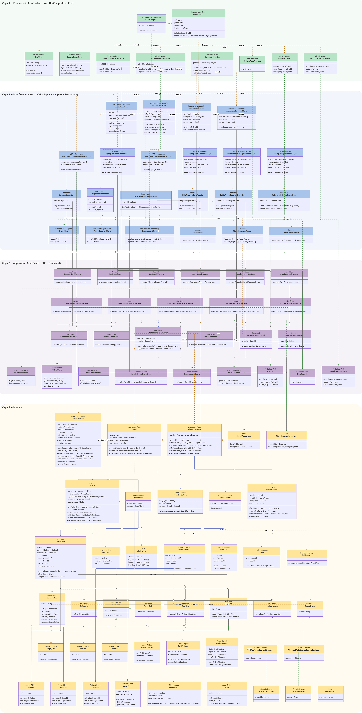

# Arrow Maze — Escape Puzzle (Cliente React Native)

Cliente móvil del juego de puzzle **Arrow Maze**, construido con **React Native + Expo** y
**TypeScript estricto**. Implementa toda la mecánica del juego (movimiento, rotación,
colisión, victoria/derrota, puntuación) en el cliente; el backend (NestJS + PostgreSQL,
repositorio hermano) solo crea, valida estructuralmente y sirve niveles.

El proyecto sigue **Clean Architecture** (4 capas) + **SOLID** + patrones **GoF** + **AOP vía
Decorator** + **DDD táctico con agregados**. La guía completa de arquitectura vive en
[`CLAUDE.md`](./CLAUDE.md) — este README documenta específicamente SOLID, los patrones GoF y
el AOP, con ejemplos de código reales.

---

## Tabla de contenidos

- [Stack tecnológico](#stack-tecnológico)
- [Cómo correr el proyecto](#cómo-correr-el-proyecto)
- [Diagrama de arquitectura](#diagrama-de-arquitectura)
- [Principios SOLID](#principios-solid)
- [Patrones de diseño (GoF)](#patrones-de-diseño-gof)
- [AOP con SOLID](#aop-con-solid)

---

## Stack tecnológico

| Área | Decisión |
| --- | --- |
| Framework | React Native con **Expo** (managed workflow) |
| Lenguaje | TypeScript (`strict: true`, sin `any`) |
| Estado / Presenters | **Zustand**, confinado a `interface-adapters/presenters/` |
| Navegación | React Navigation (native-stack) |
| Persistencia local | `expo-sqlite` (progreso + cache de leaderboard) + `expo-secure-store` (token JWT) |
| Audio | `expo-audio` |
| i18n | `i18next` + `react-i18next` + `expo-localization` (ES / EN) |
| HTTP | `fetch` envuelto en un `HttpClient` propio |
| Testing | Jest + `jest-mock-extended` |
| CI/CD | GitHub Actions |

---

## Cómo correr el proyecto

```bash
npm install
npx expo start          # desarrollo (Expo Go / dev client)
npm run android          # abrir directo en emulador/dispositivo Android
npm run ios              # ídem iOS
npm run web               # preview web (login/registro solamente — expo-secure-store no soporta web)

npm run typecheck         # tsc --noEmit
npm test                  # jest
eas build -p android      # APK de release (ver eas.json)
```

La URL base del backend se configura en `app.config.ts` (`extra.apiBaseUrl`).

---

## Diagrama de arquitectura



---

## Principios SOLID

Los cinco principios están aplicados en el dominio y la capa de aplicación, no solo declarados.
Cada uno con un ejemplo real del código del proyecto (la aplicación a los decoradores AOP se ve
en detalle en la sección siguiente).

### S — Single Responsibility

`GameSession` (invariantes del juego), `ScoringStrategy` (política de puntaje) y
`SqlitePlayerProgressRepository` (persistencia) son tres clases para tres razones de cambio
distintas. `GameSession` nunca calcula puntaje ni sabe de SQLite — delega en la política inyectada:

```typescript
// src/domain/game-session/GameSession.ts
private static computeScore(
  rules: LevelRules,
  movesUsed: number,
  failedMoves: number,
  timeUsed: number,
  scoring: ScoringStrategy,
): Score {
  return scoring.score({
    maxPossibleScore: rules.maxPossibleScore,
    movesUsed,
    maxMoves: rules.maxMoves,
    failedMoves,
    timeUsedSec: timeUsed,
    timeLimitSec: rules.timeLimit,
  });
}
```

Si cambia la fórmula de puntaje, se toca `ScoringStrategy` — nunca `GameSession`. Si cambia cómo
se persiste el progreso, se toca `SqlitePlayerProgressRepository` — nunca los casos de uso que la
consumen a través de `IPlayerProgressRepository`.

### O — Open/Closed

`ScoringStrategy` es la abstracción; `GameSession` depende solo de ella y jamás se modifica para
sumar una fórmula nueva:

```typescript
// src/domain/shared/services/ScoringStrategy.ts
export interface ScoringStrategy {
  score(input: ScoringInput): Score;
}

// src/domain/shared/services/FailedMovesScoringStrategy.ts
export class FailedMovesScoringStrategy implements ScoringStrategy {
  constructor(private readonly failedMoveWeight: number = 1) {}
  score(input: ScoringInput): Score { /* penaliza solo movimientos fallidos */ }
}

// src/domain/shared/services/TimeAndFailedMovesScoringStrategy.ts
export class TimeAndFailedMovesScoringStrategy implements ScoringStrategy {
  constructor(
    private readonly timeWeight: number = 0.5,
    private readonly failedMoveWeight: number = 0.5,
  ) {}
  score(input: ScoringInput): Score { /* penaliza tiempo Y movimientos fallidos */ }
}
```

Agregar una tercera política de puntaje es **crear una clase nueva** que implemente
`ScoringStrategy` y cablearla en `container.ts` — cero cambios en `GameSession` ni en las
existentes. Lo mismo pasa con `CellFactory` (`src/domain/level/CellFactory.ts`): un tipo de
celda nuevo es un `case` más en el `switch` y una clase `CellType` nueva, sin tocar
`WallCell`/`EmptyCell`/`ExitCell`.

### L — Liskov Substitution

`WallCell` y `ExitCell` implementan `CellType` y son **intercambiables** en cualquier sitio que
espere esa interfaz — el código que las consume nunca hace `instanceof`:

```typescript
// src/domain/shared/board/cells/WallCell.ts
export class WallCell implements CellType {
  readonly id: CellTypeId = 'wall';
  isPassable(): boolean { return false; }
}

// src/domain/shared/board/cells/ExitCell.ts
export class ExitCell implements CellType {
  readonly id: CellTypeId = 'exit';
  isPassable(): boolean { return true; }
}

// src/domain/game-session/Board.ts — slideChain(): no le importa cuál subclase es
const cell = this.terrainAt(next);
if (!cell.isPassable()) {
  return { board: this, outcome: 'Reverted' };
}
```

`Board.slideChain` funciona igual sin importar si `cell` es `WallCell`, `EmptyCell` o `ExitCell`:
cualquiera puede sustituir a `CellType` sin romper el comportamiento esperado por quien la usa.

### I — Interface Segregation

`CellType` es deliberadamente mínima (`id` + `isPassable()`); rotar es una interfaz **separada**
(`IRotatable`) que solo implementa `ArrowChain`, para no forzar a las celdas de terreno a cargar
con un método que no les corresponde:

```typescript
// src/domain/shared/board/cells/CellType.ts
export interface CellType {
  readonly id: CellTypeId;
  isPassable(): boolean;
}

// src/domain/game-session/IRotatable.ts
export interface IRotatable {
  rotate(): IRotatable;
}
```

Si `CellType` incluyera `rotate()`, `WallCell` y `ExitCell` tendrían que implementar un método
que no tiene sentido para terreno estático. Lo mismo aplica a los puertos técnicos
(`ITokenStore`, `IAudioService`, `ILogger`): cada uno es chico y de un solo propósito, en vez de
una interfaz gigante tipo `IInfra` con todo adentro.

### D — Dependency Inversion

Los casos de uso dependen de la **abstracción** del repositorio (`ILevelRepository`, definida en
el dominio), nunca de `HttpLevelRepository`:

```typescript
// src/domain/level/ILevelRepository.ts
export interface ILevelRepository {
  findAll(): Promise<Level[]>;
  findById(id: LevelId): Promise<Level | null>;
}

// src/application/use-cases/levels/GetLevelsUseCase.ts
export class GetLevelsUseCase implements IQueryService<GetLevelsQuery, Level[]> {
  constructor(private readonly levelRepository: ILevelRepository) {}

  async execute(_query: GetLevelsQuery): Promise<Level[]> {
    const levels = await this.levelRepository.findAll();
    return [...levels].sort((a, b) => a.order.sequence - b.order.sequence);
  }
}
```

`GetLevelsUseCase` no sabe que la implementación real es HTTP — podría ser una en memoria
(como `InMemoryLevelRepository` en los tests) sin cambiar una línea del caso de uso. Solo
`infrastructure/di/container.ts` conoce la clase concreta y la inyecta.

---

## Patrones de diseño (GoF)

Solo los que están **realmente implementados y cumplen su función** en este código — no la
lista aspiracional de `CLAUDE.md`, ni patrones a medias. Se excluyeron explícitamente por no
cumplir su función completa: **Abstract Factory** (solo hay Factory Method, no una familia de
fábricas), **Builder** (`BoardBuilder` arma el `Board` en pasos, pero desde un `BoardDefinition`
ya parseado, no desde JSON/YAML, y no ensambla reglas ni elementos opcionales), **Facade** (no
existe ningún `GameServiceFacade` ni equivalente), **Template Method** (`Level` es una clase
concreta, no hay una `BaseLevel` abstracta con subclases), y **Command** (`MoveArrowCommand`/
`GameCommandInvoker` encapsulan la acción, pero el proyecto decidió explícitamente no tener
historial ni undo/redo, que es parte de la función pedida).

### Creacionales

#### Factory Method

`CellFactory.create()` decide la subclase de `CellType` sin que el caller conozca
`WallCell`/`EmptyCell`/`ExitCell`/`GridArrowCell`:

```typescript
// src/domain/level/CellFactory.ts
export class CellFactory {
  static create(data: CellRawData): CellType {
    switch (data.type) {
      case 'grid_arrow':
        return new GridArrowCell(GridDirection.of(CellFactory.requireDirection(data)));
      case 'wall':
        return new WallCell();
      case 'empty':
        return new EmptyCell();
      case 'exit':
        return new ExitCell();
      default:
        throw new DomainError(`Unknown cell type: ${data.type as string}`);
    }
  }
}
```

#### Singleton

`ExpoAudioService` (el gestor global de audio) expone un único punto de acceso
(`getInstance`), con constructor privado:

```typescript
// src/infrastructure/audio/ExpoAudioService.ts
export class ExpoAudioService implements IAudioService {
  private static instance: ExpoAudioService | null = null;

  private constructor(sources: Record<string, AudioSource>) {
    this.players = ExpoAudioService.preload(sources);
  }

  static getInstance(sources: Record<string, AudioSource>): ExpoAudioService {
    if (ExpoAudioService.instance === null) {
      ExpoAudioService.instance = new ExpoAudioService(sources);
    }
    return ExpoAudioService.instance;
  }
}
```

### Estructurales

#### Composite

`BoardView` uniforma celdas sueltas y cadenas de varios nodos bajo la misma proyección de
solo-lectura para pintar — la UI no distingue "una celda" de "un tren de nodos":

```typescript
// src/domain/game-session/BoardView.ts
export class ChainView {
  constructor(
    readonly chainId: ChainId,
    readonly segments: readonly GridPosition[],
    readonly headDirection: Direction,
  ) {}
}

export class BoardView {
  constructor(
    readonly cells: readonly CellView[],
    readonly chains: readonly ChainView[],
  ) {}
}
```

#### Adapter

`HttpClient` adapta `fetch` (red) al puerto `IHttpClient`; `SqlitePlayerProgressRepository`
adapta `expo-sqlite` (persistencia) al puerto `IPlayerProgressRepository` — nadie fuera de
infraestructura conoce la librería concreta:

```typescript
// src/interface-adapters/ports/IHttpClient.ts
export interface IHttpClient {
  get<T>(path: string): Promise<T>;
  post<T>(path: string, body: unknown): Promise<T>;
}

// src/infrastructure/http/HttpClient.ts
export class HttpClient implements IHttpClient {
  async get<T>(path: string): Promise<T> {
    return this.request<T>('GET', path);
  }
  async post<T>(path: string, body: unknown): Promise<T> {
    return this.request<T>('POST', path, body);
  }
  // request(): arma la llamada real a fetch() y normaliza no-2xx en HttpError
}
```

### Comportamiento

#### Strategy

`ScoringStrategy` es la política de puntaje intercambiable en tiempo de ejecución;
`GameSession` depende solo de la interfaz, nunca de una fórmula concreta:

```typescript
// src/domain/shared/services/ScoringStrategy.ts
export interface ScoringStrategy {
  score(input: ScoringInput): Score;
}

// src/domain/shared/services/FailedMovesScoringStrategy.ts
export class FailedMovesScoringStrategy implements ScoringStrategy {
  constructor(private readonly failedMoveWeight: number = 1) {}
  score(input: ScoringInput): Score { /* penaliza solo movimientos fallidos */ }
}
```

#### Observer

`GameSession` acumula `GameEvent` (`ArrowChainExited`, `LevelCompleted`) durante una
transición; el store los drena con `pullEvents()` y notifica a la UI y al audio:

```typescript
// src/domain/shared/events/GameEvent.ts
export interface GameEvent {
  readonly name: string;
}
export class ArrowChainExited implements GameEvent {
  readonly name = 'ArrowChainExited' as const;
  constructor(readonly chainId: ChainId) {}
}

// src/domain/game-session/GameSession.ts
pullEvents(): readonly GameEvent[] {
  return this.state.events;
}

// src/interface-adapters/presenters/useGameStore.ts
if (session.pullEvents().some((event) => event.name === 'ArrowChainExited')) {
  void deps.audioService.playEffect(SFX.chainExit);
}
```

#### State

`GameStatus` gestiona el ciclo de vida de la partida con estados explícitos
(`Playing`/`Paused`/`Victory`/`Defeat`), en vez de un `switch` sobre un enum disperso:

```typescript
// src/domain/game-session/value-objects/GameStatus.ts
export interface GameStatus {
  readonly name: 'Playing' | 'Paused' | 'Victory' | 'Defeat';
  canAct(): boolean;
  pause(): GameStatus;
  resume(): GameStatus;
}

class PlayingStatus implements GameStatus {
  readonly name = 'Playing' as const;
  canAct(): boolean { return true; }
  pause(): GameStatus { return GameStatus.Paused; }
  resume(): GameStatus { return this; }
  // ...
}

export const GameStatus = {
  Playing: new PlayingStatus() as GameStatus,
  Paused: new PausedStatus() as GameStatus,
  Victory: new VictoryStatus() as GameStatus,
  Defeat: new DefeatStatus() as GameStatus,
} as const;
```

> **Decorator**: sí está implementado en el proyecto, pero no decorando celdas — decora los
> puertos CQS para AOP (logging, auth guard, performance, caching). Desarrollado en detalle,
> con la cadena completa de composición, en la sección siguiente.

---

## AOP con SOLID

El proyecto **no usa ninguna librería de AOP** (nada de `reflect-metadata`, decoradores
`@Injectable`/`@Around`, etc.). Los *cross-cutting concerns* (logging, autenticación,
performance, cache) se resuelven con el patrón **GoF Decorator** aplicado sobre los dos
puertos CQS de método único (`ICommandService<TCommand>` / `IQueryService<TQuery, TResult>`):
cada aspecto es una clase que implementa el **mismo puerto** que el caso de uso que envuelve
y delega en él por composición (`decoratee`). El caso de uso real nunca sabe que está
decorado — nunca llama al logger, nunca revisa la sesión.

Viven todos en `src/interface-adapters/decorators/`, un archivo por decorador, **cada uno
con su par Command/Query** para no romper CQS mezclando ambos puertos en una sola clase:

| Decorador | Puerto | Qué hace | Dependencias |
| --- | --- | --- | --- |
| `AuthGuardCommandDecorator` / `AuthGuardQueryDecorator` | `ICommandService` / `IQueryService` | Antes de delegar, llama a `tokenStore.hasActiveSession()`; si no hay sesión activa, lanza `Error('Not authenticated')` y **ni siquiera invoca** al `decoratee`. | `ITokenStore` |
| `LoggingCommandDecorator` / `LoggingQueryDecorator` | `ICommandService` / `IQueryService` | Loguea `"<caso> started"` antes, y `"<caso> completed"` (con `durationMs`) o `"<caso> failed"` (con el error) después — en un `try/catch` que siempre re-lanza, para no tragarse errores. | `ILogger`, `ITimeProvider`, `useCaseName` |
| `PerformanceQueryDecorator` | `IQueryService` | Mide la duración con `ITimeProvider` y solo emite un `logger.warn(...)` si supera `slowThresholdMs` (1000ms por defecto). A diferencia de `LoggingQueryDecorator`, que narra **toda** llamada, este solo se queja de las **lentas** — un concern distinto, una clase distinta. | `ILogger`, `ITimeProvider`, `slowThresholdMs` |
| `CachingQueryDecorator` | `IQueryService` | Memoiza el resultado en un `Map` interno con TTL (`expiresAt`), usando una función `keyOf(query)` inyectada para construir la clave de cache — así es genérico sobre cualquier query, no conoce `GetLeaderboardUseCase` ni ningún caso de uso concreto. | `ITimeProvider`, `ttlMs`, `keyOf` |

No existe una versión *Caching* ni *Performance* del lado Command a propósito: mutar no es
cacheable, y por ahora ningún command es lo bastante costoso como para justificar medirlo.

### Cómo se arman las cadenas (composición, no herencia)

El Composition Root (`infrastructure/di/container.ts`) decide, caso de uso por caso de uso,
qué decoradores aplicar y en qué orden — el orden importa: **AuthGuard va afuera de todo**
para no gastar tiempo en logging/caching de una llamada que ni siquiera está autenticada.

```
AuthGuard → Logging → Performance / Caching → caso de uso real
```

Ejemplos reales tomados de `container.ts`:

```ts
// Query protegida simple (§14: Auth ✅)
const decoratedGetLevelsUseCase = new AuthGuardQueryDecorator(
  new LoggingQueryDecorator(getLevelsUseCase, logger, timeProvider, 'GetLevelsUseCase'),
  tokenStore,
);

// Query protegida y costosa: Performance queda pegado al caso de uso real,
// Logging por fuera de Performance, AuthGuard por fuera de todo.
const decoratedStartGameUseCase = new AuthGuardQueryDecorator(
  new LoggingQueryDecorator(
    new PerformanceQueryDecorator(startGameUseCase, logger, timeProvider, 'StartGameUseCase'),
    logger, timeProvider, 'StartGameUseCase',
  ),
  tokenStore,
);

// Query protegida y cacheable: Caching queda pegado al caso de uso real
// (para que Logging reporte el tiempo real de la llamada, hit o miss).
const decoratedGetLeaderboardUseCase = new AuthGuardQueryDecorator(
  new LoggingQueryDecorator(
    new CachingQueryDecorator(
      getLeaderboardUseCase, timeProvider, 60_000,
      (query) => `${query.levelId.toString()}:${query.limit}`,
    ),
    logger, timeProvider, 'GetLeaderboardUseCase',
  ),
  tokenStore,
);

// Command público (§14: Auth ❌) — login/registro no pueden exigir sesión
// para conseguir una sesión, así que no llevan AuthGuard.
const decoratedLoginUseCase = new LoggingQueryDecorator(loginUseCase, logger, timeProvider, 'LoginUseCase');
```

`ClearLocalProgressUseCase` es la única excepción documentada a la regla "todo lo protegido
lleva AuthGuard": corre desde `logout()`, potencialmente **después** de que la sesión ya se
borró, así que solo lleva `Logging` — exigir sesión activa para limpiar datos locales al
cerrar sesión sería una contradicción.

### Qué aspectos de AOP se aplicaron, y cómo cumple cada uno con SOLID

Cuatro aspectos, cada uno su propia clase (par Command/Query), con el código exacto de por
qué cumple SOLID — no una explicación aparte del principio, sino la razón puntual de **este**
decorador.

#### 1. AuthGuard — verificación de sesión

`AuthGuardCommandDecorator` / `AuthGuardQueryDecorator`: antes de delegar, preguntan
`tokenStore.hasActiveSession()`; si no hay sesión, lanzan `Error('Not authenticated')` y **ni
siquiera llaman** al caso de uso real.

```typescript
// src/interface-adapters/decorators/AuthGuardCommandDecorator.ts
export class AuthGuardCommandDecorator<TCommand> implements ICommandService<TCommand> {
  constructor(
    private readonly decoratee: ICommandService<TCommand>,
    private readonly tokenStore: ITokenStore,
  ) {}

  async execute(command: TCommand): Promise<void> {
    const hasSession = await this.tokenStore.hasActiveSession();
    if (!hasSession) {
      throw new Error('Not authenticated');
    }
    await this.decoratee.execute(command);
  }
}
```

- **S**: su única razón de cambio es la política de autenticación — no loguea, no cachea, no
  mide tiempo.
- **L**: implementa `ICommandService<TCommand>`, el mismo contrato que el caso de uso que
  envuelve, así que `container.ts` lo sustituye en cualquier lugar donde se esperaba el caso
  de uso pelado, sin que nadie más se entere.
- **D**: depende de `ITokenStore` (puerto de `application/ports/`) y de
  `ICommandService<TCommand>` (puerto CQS) — nunca de `SecureTokenStore` ni de
  `RegisterUserUseCase` concretos.

#### 2. Logging — trazabilidad de entrada/salida/duración

`LoggingCommandDecorator` / `LoggingQueryDecorator`: loguean `"<caso> started"` antes, y
`"<caso> completed"` (con `durationMs`) o `"<caso> failed"` (con el error) después, en un
`try/catch` que siempre re-lanza.

```typescript
// src/interface-adapters/decorators/LoggingCommandDecorator.ts
export class LoggingCommandDecorator<TCommand> implements ICommandService<TCommand> {
  constructor(
    private readonly decoratee: ICommandService<TCommand>,
    private readonly logger: ILogger,
    private readonly timeProvider: ITimeProvider,
    private readonly useCaseName: string,
  ) {}

  async execute(command: TCommand): Promise<void> {
    const startedAt = this.timeProvider.now();
    this.logger.info(`${this.useCaseName} started`, { command });
    try {
      await this.decoratee.execute(command);
      this.logger.info(`${this.useCaseName} completed`, {
        durationMs: this.timeProvider.now() - startedAt,
      });
    } catch (error) {
      this.logger.error(`${this.useCaseName} failed`, {
        durationMs: this.timeProvider.now() - startedAt,
        error,
      });
      throw error;
    }
  }
}
```

- **S**: su única razón de cambio es el formato/contenido del log — si mañana cambia a JSON
  estructurado, se toca esta clase y ninguna otra.
- **O**: se agrega a cualquier caso de uso nuevo envolviéndolo en `container.ts`, sin tocar
  `LoggingCommandDecorator` ni el caso de uso.
- **D**: depende de `ILogger`/`ITimeProvider` (puertos), nunca de `ConsoleLogger`/
  `SystemTimeProvider` concretos — se podría cambiar a un logger remoto sin tocar esta clase.

#### 3. Performance — alerta de queries lentas

`PerformanceQueryDecorator`: mide la duración con `ITimeProvider` y solo emite
`logger.warn(...)` si supera `slowThresholdMs` (1000ms por defecto). A diferencia de
`LoggingQueryDecorator`, que narra **toda** llamada, este solo se queja de las **lentas**.

```typescript
// src/interface-adapters/decorators/PerformanceQueryDecorator.ts
export class PerformanceQueryDecorator<TQuery, TResult>
  implements IQueryService<TQuery, TResult>
{
  constructor(
    private readonly decoratee: IQueryService<TQuery, TResult>,
    private readonly logger: ILogger,
    private readonly timeProvider: ITimeProvider,
    private readonly useCaseName: string,
    private readonly slowThresholdMs: number = 1000,
  ) {}

  async execute(query: TQuery): Promise<TResult> {
    const startedAt = this.timeProvider.now();
    const result = await this.decoratee.execute(query);
    const durationMs = this.timeProvider.now() - startedAt;
    if (durationMs > this.slowThresholdMs) {
      this.logger.warn(`${this.useCaseName} took ${durationMs}ms`, { durationMs });
    }
    return result;
  }
}
```

- **S**: es una clase **separada** de `LoggingQueryDecorator` precisamente porque "narrar toda
  llamada" y "alertar solo las lentas" son dos razones de cambio distintas, aunque ambas
  midan tiempo.
- **O**: genérico sobre `TQuery`/`TResult` — hoy solo envuelve `StartGameUseCase` (ver
  `container.ts`), pero sirve para cualquier query costosa futura sin modificarse.

#### 4. Caching — memoización con TTL

`CachingQueryDecorator`: memoiza el resultado en un `Map` interno con TTL, usando una función
`keyOf(query)` inyectada para construir la clave — así es genérico sobre cualquier query, no
conoce `GetLeaderboardUseCase` ni ningún caso de uso concreto.

```typescript
// src/interface-adapters/decorators/CachingQueryDecorator.ts
export class CachingQueryDecorator<TQuery, TResult>
  implements IQueryService<TQuery, TResult>
{
  private readonly cache = new Map<string, CacheEntry<TResult>>();

  constructor(
    private readonly decoratee: IQueryService<TQuery, TResult>,
    private readonly timeProvider: ITimeProvider,
    private readonly ttlMs: number,
    private readonly keyOf: (query: TQuery) => string,
  ) {}

  async execute(query: TQuery): Promise<TResult> {
    const key = this.keyOf(query);
    const now = this.timeProvider.now();
    const cached = this.cache.get(key);
    if (cached !== undefined && cached.expiresAt > now) {
      return cached.result;
    }
    const result = await this.decoratee.execute(query);
    this.cache.set(key, { result, expiresAt: now + this.ttlMs });
    return result;
  }
}
```

- **S**: su única razón de cambio es la política de invalidación de cache (hoy TTL fijo) —
  no sabe nada de leaderboards ni de ningún dominio.
- **O**: agregar cache a una query nueva es pasarle su propio `keyOf` en `container.ts`, sin
  tocar esta clase; hoy solo envuelve `GetLeaderboardUseCase`
  (`(query) => \`${query.levelId.toString()}:${query.limit}\``).
- **D**: depende de `ITimeProvider` (puerto), nunca de `Date.now()` directo — así el TTL es
  testeable con un reloj fake.

#### Los cuatro comparten (I y L)

- **I — Interface Segregation**: los cuatro implementan `ICommandService<TCommand>` o
  `IQueryService<TQuery, TResult>` — interfaces de **un solo método** (`execute`). Ninguno
  carga con un método que no usa; por eso hay pares Command/Query separados en vez de una
  interfaz `IUseCase` con `executeCommand()` + `executeQuery()`.
- **L — Liskov Substitution**: como los cuatro cumplen el mismo contrato que el caso de uso
  que envuelven, `container.ts` los anida sin que ninguno note si por dentro hay un caso de
  uso "pelado" o ya envuelto dos veces:

```typescript
// src/infrastructure/di/container.ts
const decoratedStartGameUseCase = new AuthGuardQueryDecorator(
  new LoggingQueryDecorator(
    new PerformanceQueryDecorator(startGameUseCase, logger, timeProvider, 'StartGameUseCase'),
    logger, timeProvider, 'StartGameUseCase',
  ),
  tokenStore,
);
```
